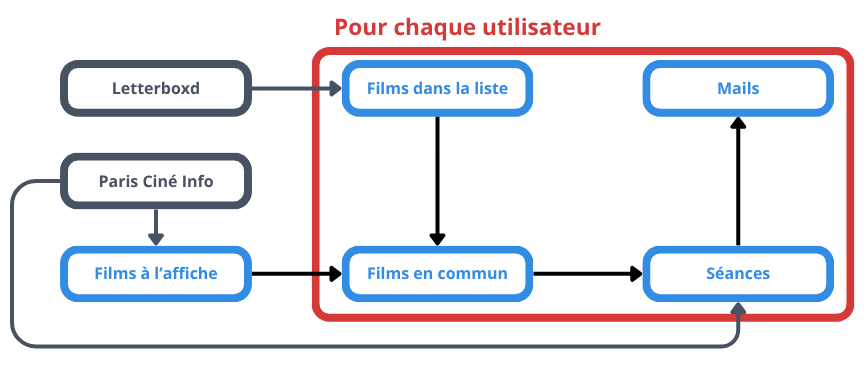

# Paris Ciné Alert

<p align="center">
  
</p>

<p align="center">
  <a href="https://opensource.org/licenses/MIT"></a>
      
    <a href="https://docs.google.com/forms/d/e/1FAIpQLSclen-De2N-KdlU4a6fdU1xm7ynHh9aOwayF9kkenURnMlsDA/viewform?usp=dialog"></a>
</p>

---

**Paris Ciné Alert** permet aux cinéphiles parisiens de recevoir chaque mercredi matin un e-mail récapitulatif de toutes les séances programmées pour les films présents dans leur **watchlist ou liste Letterboxd**.

---

## S'inscrire au service

Pour recevoir l'alerte hebdomadaire, remplissez simplement ce **[formulaire Google Form](https://docs.google.com/forms/d/e/1FAIpQLSclen-De2N-KdlU4a6fdU1xm7ynHh9aOwayF9kkenURnMlsDA/viewform?usp=dialog)**.

Seules deux informations sont nécessaires :
* Votre **adresse e-mail** de réception.
* L'**URL publique de votre liste ou watchlist Letterboxd**.

---

## Fonctionnement

Paris Ciné Alert repose essentiellement sur le site **[Paris Ciné Infos](https://paris-cine.info/?)**, qui regroupe l'ensemble des séances dans les cinémas parisiens. Ci dessous un graphe simplifié du fonctionnement de Paris Ciné Alert:

<p align="center">
  
</p>

---

## Lancer le projet en local

Si vous souhaitez exécuter le script vous-même, adapter la fréquence ou l'automatiser sur votre propre machine. Vous pouvez aussi résumer les étapes ci dessous ceci dans un fichier bash et / ou le scheduler. L'éxécution des commandes suivantes permettent juste de lancer le script et de recevoir le mail, mais n'automatise pas l'envoi systématique tous les mercredis matins.

1. **Cloner le dépôt :**
   ```bash
   git clone https://github.com/elouanzer/paris-cine-alert.git
   cd paris-cine-alert
   ```

2. **Installer `uv` (si ce n'est pas déjà fait) :**
   ```bash
   # macOS / Linux
   curl -LsSf [https://astral.sh/uv/install.sh](https://astral.sh/uv/install.sh) | sh

   # Windows
   powershell -c "irm [https://astral.sh/uv/install.ps1](https://astral.sh/uv/install.ps1) | iex"
   ```

3. **Synchroniser l'environnement et installer les dépendances :**
   ```bash
   uv sync
   ```

4. **Configurer les variables d'environnement :**
   Créez un fichier `.env` à la racine et mettez y les variables suivantes :
   ```env
    SMTP_SERVER = "smtp.gmail.com" # pour gmail
    SMTP_PORT = 587 # pour gmail
    EMAIL_SENDER = "votre_mail@gmail.com"
    SMTP_LOGIN = "votre_mail@gmail.com"
    SMTP_PASSWORD = "votre_mot_de_passe_d_application_16_caracteres"
   ```

5. **Exécuter le script :**
   ```bash
   uv run scripts/local_main.py --url url_de_votre_liste --email votre_mail
   ```
---

## Roadmap & Pistes d'amélioration

### Fonctionnalités
- Compatibilité avec d'autres plateformes (SensCritique, Millimètre, TV Time...)
- Extension à d'autres villes de France
- Indication des cartes d'abonnement acceptées (UGC Illimité, CinéPass Pathé...)
- Vérification et sécurisation des liens de réservation

### Performance & Fiabilité
- Tests de validation des formats de scraping (Letterboxd & Paris Ciné Infos) avant exécution
- Lancement des tests unitaires avant le lancement de l'automation
- Optimisation des temps de traitement et requêtes
- Gestion des gros volumes de séances (pagination, tri par pertinence ou limitation visuelle dans l'e-mail)

### UX & Infrastructure
- Remplacement du Google Form par une interface web dédiée et une base de données
- Version sombre pour le template d'e-mail

---

## Contribuer

Je ne suis pas développeur de formation : **toutes les suggestions, corrections et retours sont les bienvenus**, même pour des idées encore embryonnaires !

1. Ouvrez une [Issue](https://github.com/elouanzer/paris-cine-alert/issues) pour discuter d'un bug ou d'une idée.
2. Forkez le projet, créez une branche dédiée (`git checkout -b feature/amelioration`) et soumettez une **Pull Request**.

---

## Licence

Distribué sous licence **MIT**. Voir `LICENSE` pour plus d'informations.